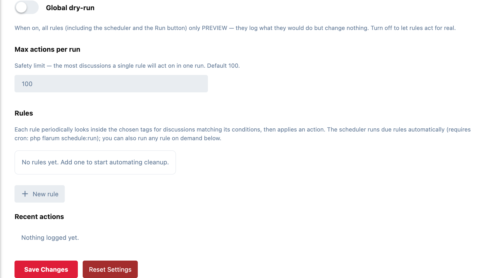

# Janitor

Discussion housekeeping that runs itself. Write rules that look inside chosen
tags for discussions matching conditions (age, tags, reply count), then hide,
lock, retag, move or delete them, so a busy section stays tidy without a
moderator doing it by hand.

- **Rules:** each has a scope (one or more tags, or all of them), conditions, an action and its own run frequency.
- **Conditions:** inactive for, or created more than, N days ago; has or doesn't have certain tags; minimum or maximum replies. Every condition is optional, so a rule can match on tags alone, on inactivity alone, or any combination.
- **Actions:** hide, lock, unlock, add a tag, remove a tag, move (retag), or permanently delete.
- **Runs on a schedule, or when you say.** Due rules run automatically, and any rule can be **Run** or **Previewed** on demand from the admin page.
- **Global dry-run.** Every rule, scheduled or on demand, logs what it *would* do and changes nothing. Turn it off when you're confident.
- **Shows up in your audit log.** Every live action fires Flarum's own events (hidden, deleted, tagged, locked), so audit-log and action-log extensions record Janitor's work, attributed to an admin. Previews never fire them.

## Settings

Admin → Janitor:



- **Global dry-run:** when on, every rule only previews.
- **Max actions per run:** the most discussions a single rule acts on in one run. Default 100.
- **Rules:** add, edit, run, preview and delete rules.
- **Recent actions:** the log of everything Janitor did, or would have done.

## Good to know

- **Protected by default.** Stickied and locked discussions are left alone unless a rule opts in to **include locked** (say, archiving closed sale threads) or **include stickied**. The Unlock action always includes locked discussions.
- **Delete is opt-in per rule, and permanent.** Prefer **Hide** or **Move**: hidden discussions can be restored, deleted ones can't.
- **Try a rule before trusting it.** Leave the global dry-run on and use **Preview** to see exactly which discussions a rule would hit in the action log. A preview doesn't move the rule's schedule.
- **"Inactive for N days"** measures from the last post by default, which suits archiving stale threads in a busy tag.
- **Automatic runs need Flarum's scheduler.** Your server must run this cron entry once a minute:

  ```cron
  * * * * * cd /path/to/forum && php flarum schedule:run >> /dev/null 2>&1
  ```

  Without it rules won't run on their own, though **Run** and **Preview** still work.

## Installation

```bash
composer require ernestdefoe/janitor
php flarum migrate
php flarum cache:clear
```

Then enable **Janitor** in the admin panel and open its settings to add rules.

## Updating

```bash
composer update ernestdefoe/janitor
php flarum migrate
php flarum cache:clear
```

## Licence

[MIT](LICENSE.md) © ernestdefoe
